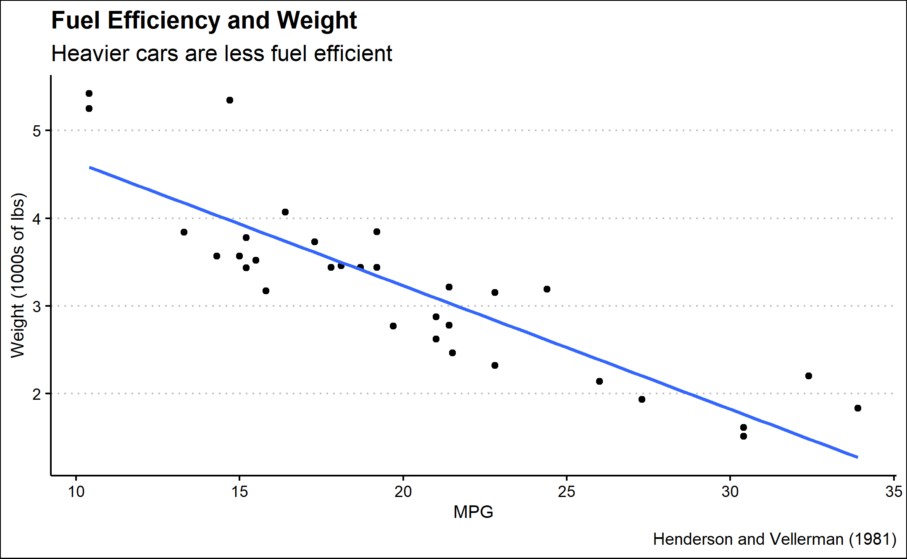

```{r setup, include=FALSE, layout = "l-body-outset"}
knitr::opts_chunk$set(echo = FALSE)
library(tidyverse)
library(ggthemes)
library(knitr)
library(rmarkdown)
library(gt)
# Learn more about creating websites with Distill at:
# https://rstudio.github.io/distill/website.html

# Learn more about publishing to GitHub Pages at:
# https://rstudio.github.io/distill/publish_website.html#github-pages

```


```{r car-plot}
car_plot <- read_rds("car-plot.rds")

car_plot

ggsave("car-plot.png", plot = car_plot)
```


```{r table-1}
table <- mtcars %>% arrange(mpg)
```


```{r table-2}
kable(table)
```


```{r table-3}
paged_table(table, options(cols.print = 12))
```


```{r table-4}
gt(table, rownames_to_stub = TRUE) %>% tab_header(title = md("**1974 Automobiles**"), 
                                                  subtitle = "The least fuel efficient cars are the heaviest") %>%
  tab_source_note("Source: Henderson and Velleman (1981)") %>%
  tab_spanner(label = "Variable Group 1", 
              columns = c(mpg, cyl, disp, hp, drat))
```


```{r image}

```

